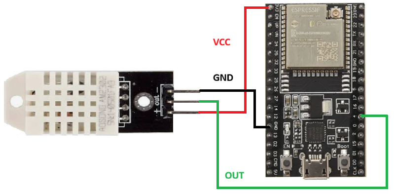

# Terma MOA Blue ESPHome Integration

Control your Terma MOA Blue radiator heating element via Home Assistant using an ESP32 and ESPHome.

## Overview

The Terma MOA Blue is a Bluetooth-controlled electric heating element designed for towel radiators and other heating applications. This project allows you to integrate it with Home Assistant, providing:

- **Climate entity** - Full thermostat control with presets (Home, Away, Boost)
- **Temperature monitoring** - Via external DHT22 sensor (recommended) or the radiator's built-in sensor
- **Manual control** - On/off switch for direct control
- **Status monitoring** - Connection status, heating state, and radiator element temperature

## Features

-  Bluetooth Low Energy (BLE) connection with persistent bonding
- Climate entity for Home Assistant thermostat integration
- External DHT22 temperature/humidity sensor support
- Automatic reconnection after power loss
- Manual override switch
- Radiator element temperature monitoring
- Room temperature and humidity monitoring
- Presets: Home (21°C), Away (16°C), Boost (24°C)

## Requirements

### Hardware

- ESP32 development board (e.g., ESP32-WROOM-32, ESP32-DevKitC) - It may work on others fine but untested.
- Terma MOA Blue heating element
- DHT22 temperature/humidity sensor (recommended)
- 10kΩ resistor (for DHT22 pull-up, may be required depending on your module)
- Jumper wires
- USB cable for programming

### Software

- [ESPHome](https://esphome.io/) 2024.1.0 or later
- [Home Assistant](https://www.home-assistant.io/) (optional, but recommended)

## Wiring

### DHT22 Sensor Wiring

Connect the DHT22 sensor to your ESP32 as follows:

```
DHT22 Pin    ESP32 Pin
─────────    ─────────
VCC    ───── 3.3V
GND    ───── GND
DATA   ───── GPIO4 (configurable)
```



**Note:** Some DHT22 modules require a 10kΩ pull-up resistor between VCC (3.3V) and the DATA pin for reliable readings. Modules with a built-in PCB typically include this resistor.  The module tested does not require this and is shown in the picture above.


## Installation

### 1. Prepare the Files

Copy both files to your ESPHome configuration directory:

- `terma-moa-blue.yaml` - Main configuration file - import into ESPHome as normal.
- `terma_ble_helper.h` - BLE helper header file - copy to the config\esphome directory in home assistant.  Note: This file is required for persistent bluetooth connections.

### 2. Configure the YAML

Edit `terma-moa-blue.yaml` and update the following:

```yaml
substitutions:
  device_name: terma-moa-blue
  friendly_name: "Bathroom Radiator"
  radiator_mac: "XX:XX:XX:XX:XX:XX"  # Your radiator's MAC address
  dht_pin: GPIO4                      # Change if using a different pin
```

#### Finding Your Radiator's MAC Address

You can find the MAC address using:

- **Android Settings:** Go to Settings → Bluetooth → Paired devices (after pairing with the Terma app)
- **Android:** Use the [nRF Connect](https://play.google.com/store/apps/details?id=no.nordicsemi.android.mcp) app to scan for nearby BLE devices. Look for "MOA Blue TERMA".
- **ESPHome Logs:** Enable the `esp32_ble_tracker` component and check the logs for discovered devices.


### 3. Configure Secrets

Ensure your `secrets.yaml` contains:

```yaml
wifi_ssid: "YourWiFiNetwork"
wifi_password: "YourWiFiPassword"
ap_password: "FallbackAPPassword"
# Optional:
# api_encryption_key: "your-api-key"
# ota_password: "your-ota-password"
```

### 4. First-Time Pairing

**Important:** The first connection requires the radiator to be in pairing mode.
   
1. Flash the ESPHome configuration to your ESP32

2. Put the Terma MOA Blue into pairing mode:
   - Press and hold the temperature button for 5 seconds on the heating element until the LED flashes
   - Refer to your Terma MOA Blue manual for specific instructions

3. Start the device within bluetooth range of the radiator
  
5. Monitor the logs - you should see:
   ```
   BLE client connected - requesting encryption...
   Passkey requested by radiator - sending 123456
   BLE connection ready
   ```

6. Once paired, the ESP32 will automatically reconnect even after power cycles

### 5. Add to Home Assistant

The device should be automatically discovered by Home Assistant. If not:

1. Go to Settings → Devices & Services
2. Click "Add Integration"
3. Search for "ESPHome"
4. Enter your device's IP address or hostname

## Configuration Options

### Using Without a DHT22 Sensor

If you don't have a DHT22 sensor, you can use the radiator's built-in temperature sensor instead. 

1. Comment out or remove the DHT22 sensor section
2. Change the climate entity sensor reference:

```yaml
climate:
  - platform: thermostat
    name: "Bathroom Heater"
    sensor: room_temp_raw  # Use radiator's built-in sensor
    # ... rest of config
```

**Note:** The radiator's built-in sensor is less accurate than an external DHT22, as it's affected by the radiator's own heat.

### Adjusting Temperature Presets

Modify the preset temperatures in the climate section:

```yaml
preset:
  - name: Home
    default_target_temperature_low: 21  # Default home temperature
  - name: Away
    default_target_temperature_low: 16  # Away/eco temperature
  - name: Boost
    default_target_temperature_low: 24  # Boost temperature
```

### Adjusting Deadband

The deadband controls when heating starts/stops relative to the target temperature:

```yaml
heat_deadband: 0.5  # Start heating 0.5°C below target
heat_overrun: 0.5   # Stop heating 0.5°C above target
```

## Entities Exposed to Home Assistant

| Entity | Type | Description |
|--------|------|-------------|
| Bathroom Heater | Climate | Main thermostat control |
| Room Temperature | Sensor | DHT22 temperature reading |
| Room Humidity | Sensor | DHT22 humidity reading |
| Radiator Room Sensor | Sensor | Radiator's built-in temperature sensor |
| Radiator Element Temperature | Sensor | Heating element temperature |
| Radiator Power (Manual) | Switch | Direct on/off control |
| Heating Active | Binary Sensor | Whether radiator is currently heating |
| Radiator BLE Connected | Binary Sensor | BLE connection status |
| Radiator BLE Presence | Binary Sensor | Whether radiator is in BLE range |
| Radiator Status | Text Sensor | Human-readable status |
| Clear BLE Bonds | Button | Reset Bluetooth pairing |
| Restart | Button | Restart the ESP32 |

## Troubleshooting

### Error reading char, status=5

This indicates an authentication error. The radiator requires encryption for reading characteristics.

**Solution:**
1. Press "Clear BLE Bonds" in Home Assistant
2. Restart the ESP32
3. Put the radiator into pairing mode
4. Wait for reconnection

### Cannot connect after power cycle

The ESP32 stores bonding information, but sometimes it needs to be re-established.

**Solution:**
1. Clear bonds on both devices:
   - Press "Clear BLE Bonds" in Home Assistant
   - Reset pairing on the radiator (hold button for 5 seconds until the LED flashes)
2. Restart the ESP32
3. Put the radiator in pairing mode

### DHT22 readings are unstable or not using the same module pictured

**Solutions:**
- Add a 10kΩ pull-up resistor between VCC and DATA
- Use shorter wires (under 1 meter)
- Ensure stable 3.3V power supply
- Try a different GPIO pin

### Radiator disconnects frequently

BLE range is limited, especially through walls.

**Solutions:**
- Move the ESP32 closer to the radiator
- Use an ESP32 with an external antenna
- Reduce WiFi interference (BLE and WiFi share the 2.4GHz band)

## Technical Details

### BLE Characteristics

| UUID | Description |
|------|-------------|
| `d97352b0-d19e-11e2-9e96-0800200c9a66` | Service UUID |
| `d97352b1-d19e-11e2-9e96-0800200c9a66` | Room temperature (current + target) |
| `d97352b2-d19e-11e2-9e96-0800200c9a66` | Heater element temperature (current + target) |
| `d97352b3-d19e-11e2-9e96-0800200c9a66` | Operating mode |

### Operating Modes

| Mode | Description |
|------|-------------|
| 0 | Off |
| 5 | Manual - Room temperature control (15-30°C) |
| 6 | Manual - Heater element control (30-60°C) |
| 7 | Schedule - Room temperature |
| 8 | Schedule - Heater element |

### Temperature Encoding

Temperatures are encoded as 4 bytes:
- Bytes 0-1: Current temperature × 10
- Bytes 2-3: Target temperature × 10

Example: 21.5°C = 215 = 0x00 0xD7

## License

This project is provided as-is for personal use. The Terma MOA Blue protocol was reverse-engineered from community efforts.

## Acknowledgments

- [Home Assistant Community](https://community.home-assistant.io/t/terma-blue-line-bluetooth-radiators-and-heating-elements/81325) - Protocol reverse engineering
- [homebridge-TERMA-MOA-Blue](https://github.com/J1mbo/homebridge-TERMA-MOA-Blue/) - A great homekit solution from J1mbo
- [ESPHome](https://esphome.io/) - Excellent IoT firmware framework
- [Anthropic Claude](https://claude.ai/) - AI assistance in developing this integration to solve the bluetooth persistent connection pain

## Contributing

Contributions are welcome! Please feel free to submit issues or pull requests.

## Disclaimer

This is an unofficial integration and is not affiliated with or endorsed by Terma. Use at your own risk. Always follow safety guidelines when working with electrical heating equipment.
